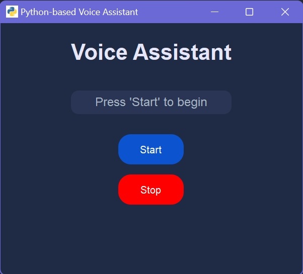
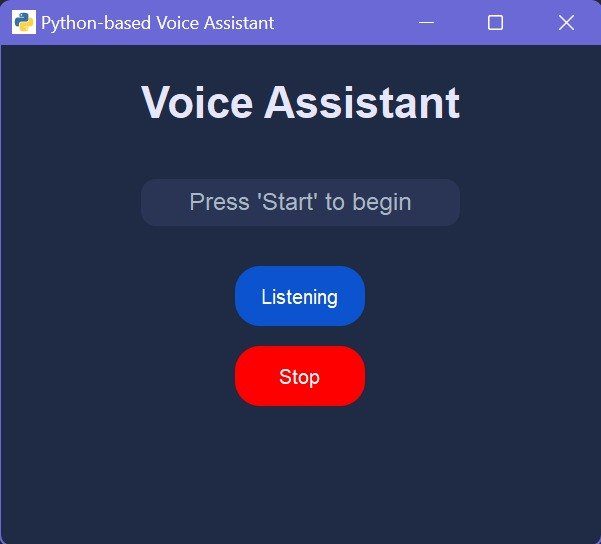
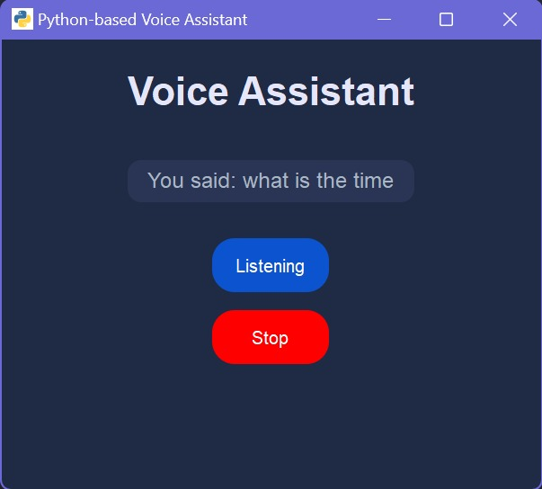

# 🎙️ Voice Assistant (Python)

A Python-based voice assistant featuring a stylish PyQt5 GUI. This desktop application understands spoken commands, responds with synthesized speech, and performs tasks like web searches, Wikipedia lookups, and telling jokes — all through voice interaction.

---

## 📖 Description

This Voice Assistant project brings together several modern Python libraries to create an intelligent and interactive assistant. With a clean graphical interface and responsive controls, users can easily start and stop voice recognition. The assistant is ideal for exploring speech recognition, text-to-speech synthesis, and natural language processing.

---

## 🔧 Technologies Used

- 🖼️ **PyQt5** – For a sleek and responsive GUI  
- 🎙️ **SpeechRecognition** – Converts speech into text  
- 🔊 **pyttsx3** – Synthesizes speech output  
- 📚 **Wikipedia API** – Summarizes knowledge from Wikipedia  
- 😂 **pyjokes** – Provides light-hearted programming jokes  
- 🌐 **webbrowser** – Opens websites based on voice commands  

---

## 🚀 Features

- 🎤 Real-time voice recognition  
- 🔊 Voice output with `pyttsx3`  
- 🌐 Browse websites by speaking  
- 📚 Fetch and narrate Wikipedia summaries  
- 😂 Crack jokes with `pyjokes`  
- 🖼️ User-friendly PyQt5 GUI  
- 🖱️ Simple Start/Stop listening buttons  

---

## 🛠️ Installation

Follow the steps below to install and run the project on your machine:

### 📥 Step 1: Clone the Repository

```bash
git clone https://github.com/your-username/voiceAssistant.git
cd voiceAssistant
```

### 🧪 Step 2: Create and Activate a Virtual Environment

```bash
python -m venv venv
```

- On **Windows**:
```bash
venv\Scripts\activate
```

- On **macOS/Linux**:
```bash
source venv/bin/activate
```

### 📦 Step 3: Install Dependencies

```bash
pip install -r requirements.txt
```

### ⚠️ PyAudio Installation Help

If you encounter issues installing `pyaudio`, try the following:

- On **Windows**:
```bash
pip install pipwin
pipwin install pyaudio
```

- On **Linux**:
```bash
sudo apt-get install portaudio19-dev
pip install pyaudio
```

### 🏃‍♂️ Step 4: Run the Application

```bash
python voice_assistant.py
```

🎙️ Speak clearly into your microphone to start interacting with your assistant.

---

## 📋 Requirements

- Python 3.6 or higher  
- PyQt5  
- pyttsx3  
- SpeechRecognition  
- wikipedia  
- pyjokes  
- pyaudio  

> ✅ All dependencies are listed in the [`requirements.txt`](requirements.txt) file.

---

 ## 🤝 Contributing

Contributions, issues, and feature requests are welcome!  
Feel free to open an issue or submit a pull request.

---

## 🖼️ Screenshots








